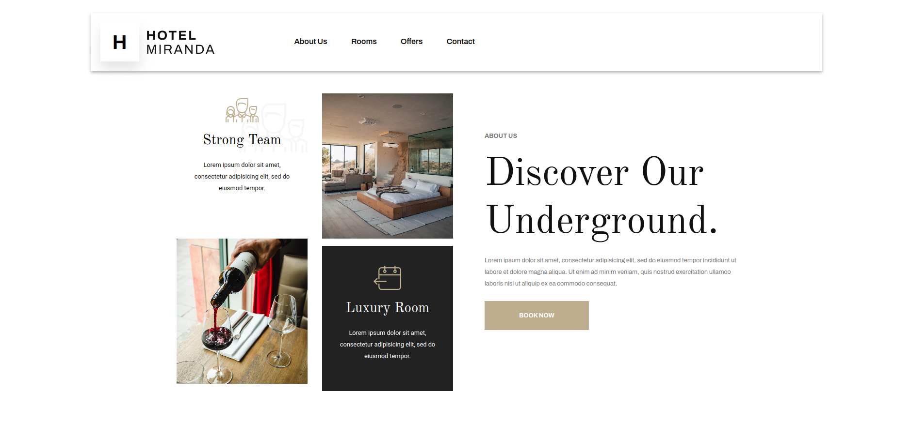
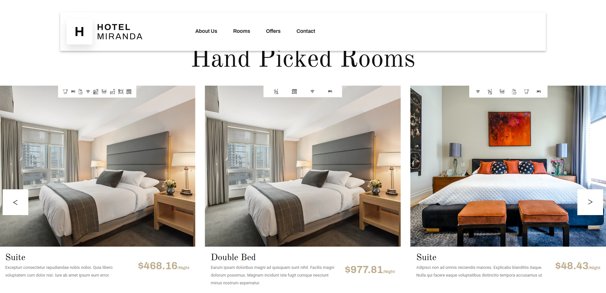

# Hotel Miranda PHP #

Miranda hotel website with php and blade.

## Installation ##

- Clone this repository.

```bash
git clone https://github.com/JoseFerAlvarez/hotel-miranda-php.git
```

- Install [PHP](https://www.php.net/downloads) (windows).

- Install [PHP](https://www.php.net/manual/es/install.unix.debian.php) (Linux).

- Install PHP (Arch).

```bash
    sudo pacman -Sy php
```

- Install [composer](https://getcomposer.org/download/).

- Install composer (Arch).

```bash
    sudo pacman -Sy composer
```

- Install [BladeOne](https://github.com/EFTEC/BladeOne).

- Open PHP Server.

```bash
    php -S localhost:8000
```

## Links to the Miranda's projects ##

- Link to [hotel-miranda-php](https://github.com/JoseFerAlvarez/hotel-miranda-php).

- Link to [hotel-miranda-laravel](https://github.com/JoseFerAlvarez/hotel-miranda-laravel).

- Link to [hotel-miranda-design](https://github.com/JoseFerAlvarez/hotel-miranda-design).

- Link to [hotel-miranda-dashboard](https://github.com/JoseFerAlvarez/hotel-miranda-dashboard).

- Link to [hotel-miranda-back](https://github.com/JoseFerAlvarez/hotel-miranda-back).

## Technologies used ##

<p align="center">


</p>

## Web View ##



